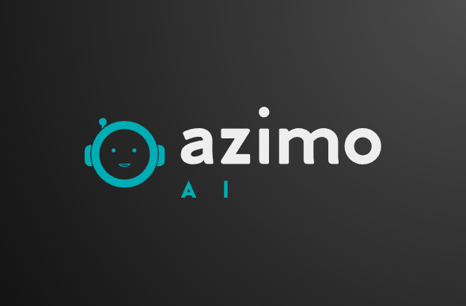

# **Azimo - HoloSea Engine** 🌊💡  laucher 26/11/2024

### 🚀 **Welcome to Azimo**  
Azimo is a next-generation **HoloSea engine** built to transform decentralized ecosystems through the power of **neural networks**, **Seal Learning**, and **Self Sea chain links**. Designed for **HoloFi**, **DeFi**, and proprietary **dApps**, Azimo empowers developers with cutting-edge tools for high-performance AI and machine learning applications.  

---

## 🧠 **What Makes Azimo Special?**

🔗 **Self Sea Neural Links**  
Revolutionizing interconnectivity, Azimo uses **chain-linked neural networks** that enable seamless data sharing and real-time decision-making across a decentralized ecosystem.  

🔥 **Fire Bunny Pistons**  
High-speed data flow optimization ensures minimal latency and maximum efficiency, keeping your apps running smoothly.  

🔒 **BJX Protocols**  
Patented by Bosco Jones, these protocols guarantee the highest standards of security, data integrity, and operational efficiency.  

⚡ **Seal Learning Technology**  
Train your models with refined, noise-free data for superior learning and decision-making accuracy.  

🌐 **HoloFi & DeFi Ready**  
Fully compatible with HoloFi and DeFi platforms, Azimo enables you to build intelligent dApps that scale effortlessly.  

---

## 🛠️ **How to Get Started?**  

1. **Clone the Repository:**  
   ```bash  
   git clone https://github.com/your-repo/azimo.git  
   cd azimo  
   ```  

2. **Install Dependencies:**  
   ```bash  
   npm install  
   ```  

3. **Run the Engine:**  
   ```bash  
   npm start  
   ```  

4. **Access the Dashboard:**  
   Navigate to `http://localhost:3000` in your browser to explore Azimo's neural link connections and dApp features.  

---

## 📚 **Documentation**  
Explore detailed guides and examples in the [Official Azimo Docs](https://docs.azimo-holosea.io).  

---

## ✨ **Features at a Glance**  

| Feature                | Description                                | Status    |  
|------------------------|--------------------------------------------|-----------|  
| Self Sea Neural Links  | Real-time chain-linked neural network flow | ✅ Ready  |  
| Fire Bunny Pistons     | High-performance data stream optimization  | ✅ Ready  |  
| BJX Protocols          | Secure and efficient decentralized data    | ✅ Ready  |  
| HoloFi Compatibility   | Built for HoloFi ecosystems                | ✅ Ready  |  

---

## 👨‍💻 **Contributing**  

We welcome contributions from the community! Here's how you can help:  

1. Fork the repository.  
2. Create a feature branch.  
3. Submit a pull request with detailed descriptions of your changes.  

---

## 🛡️ **License**  

This project is licensed under the **Apache 2.0 License**. See the `LICENSE` file for details.  


### **Azimo Logo**  


